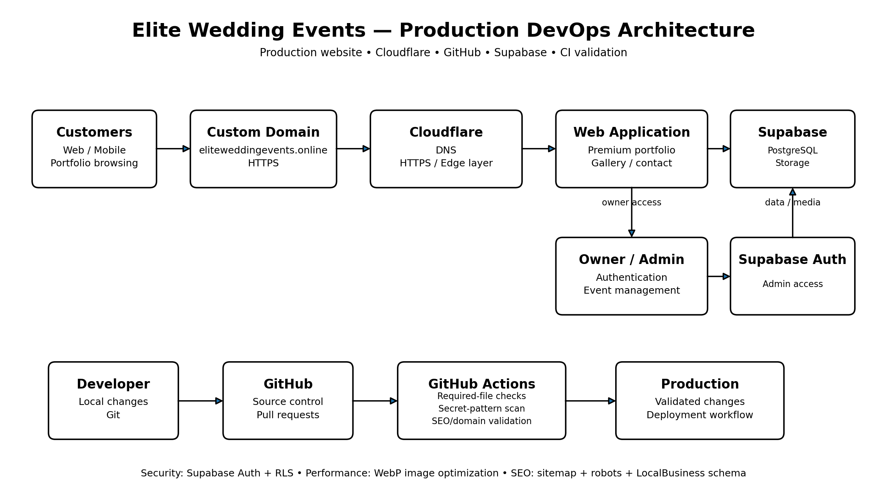

# Elite Wedding Events — Architecture

## Customer Flow

Customer → custom domain → Cloudflare → public web application → Supabase data/storage.

## Owner Flow

Owner → Admin Portal → Supabase Authentication → event metadata and portfolio storage.

## Delivery / Validation Flow

Developer → Git → GitHub → GitHub Actions → validation → production deployment.

## DevOps Controls

- Source control through GitHub
- CI validation on pushes and pull requests
- High-risk credential pattern detection
- Sitemap and robots.txt validation
- Production-domain validation
- Supabase authentication and database policies
- Client-side WebP image optimization
